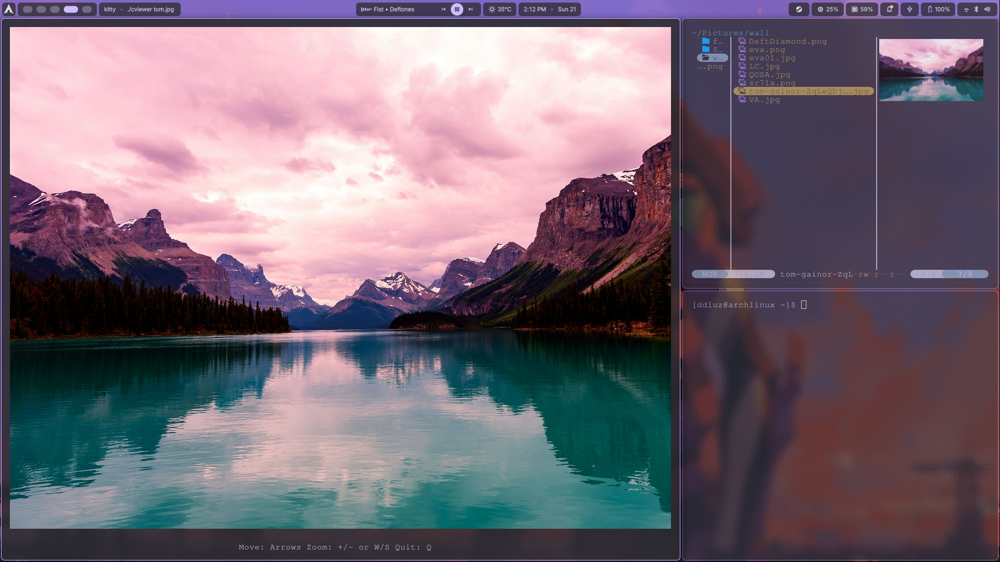

# cviewer

A lightweight image viewer for Linux terminals supporting the Kitty Graphics Protocol.

## Features

- Native Kitty Graphics Protocol rendering
- Base64 image transmission
- Lightweight and fast
- No external image libraries required
- Supports multiple image formats through stb_image

## Supported Formats

Thanks to stb_image, cviewer can load:

- JPEG / JPG
- PNG (including alpha transparency)
- BMP
- GIF (first frame only)
- TGA
- PSD
- HDR
- PIC
- PNM (PPM / PGM)

## Requirements

- Linux
- Kitty Terminal or a compatible terminal emulator supporting the Kitty Graphics Protocol (e.g. WezTerm)

## Installation

```bash
make
sudo make install
```

## Compilation

```bash
gcc -O3 -o cviewer src/main.c -lm
```

## Example

